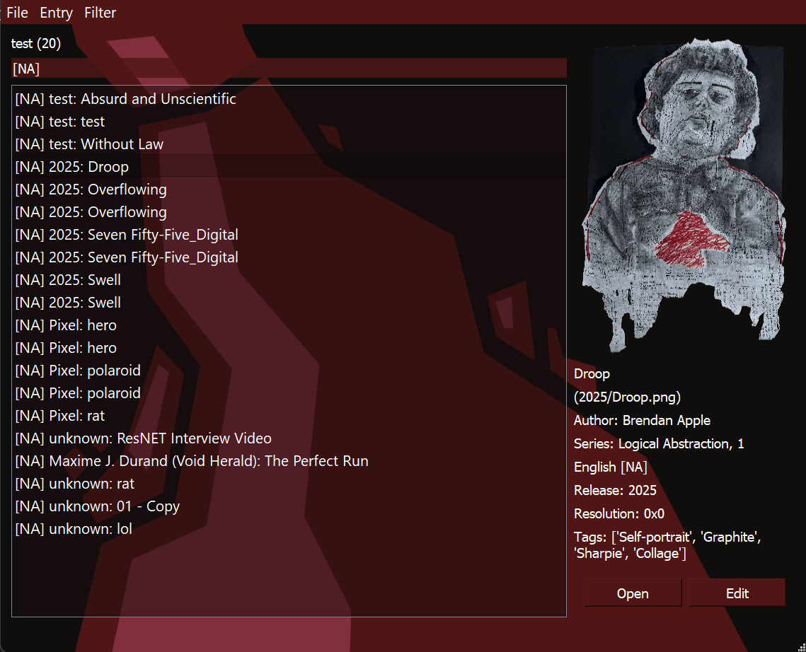

# MediAppl
Brendan Apple

## About
MediAppl is a python based media manager, 
that allows its users to access and organize local files based
on user-generated tags and metadata.
This essentially emulates the functionality of a streaming service's
website, without algorithmic suggestions. 



There is some basic automatic metadata detection, 
such as cover selection for image files, epubs, and videos. 
Furthermore, folders with numbered files, such animation frames,
will appear as entries in place of their elements.

Early versions of this tool will have feature limitations, such as
difficulty opening files in windows. 

### Future Plans
Future releases will improve automatic metadata collection from files,
especially videos and epubs. In addition, reading the metadata left
in MP3s and MP4s is under consideration.

Furthermore, the search will be made more sophisticated in the future.
It currently runs by checking substrings of every element,
so the complexity is quite high.

### Operation

##### Data Storage
File metadata is stored in APPL files, a plaintext metadata storage
format. This allows simple database manipulation by the user at the
cost of less efficient data storage compared to a binary. 
Since the expected size of user databases is in only around 
100 to 10,000 entries, this seems acceptable.

A sample appl database is shown below:
```appl
Default Database
C:/Users/

{'mp3': 'vlc', 'txt': 'vim'}
1

---

Relative Path
Cover Art Path
Name
Author
Series, 0
Language, Age Rating
-1
1920x1080
tag1, tag2
```

##### Search
When entries are read from the file, they are placed into lists
at the position in a dictionary as determined by their author,
series, tags, language, etc. In addition, they are placed in a 
central list.

**Normal Search:**
```
Text to search
```
The search text is broken into the set of its words.
For every possible combination of these words, I check the
dictionaries. Every word present is given a point. Then,
I search for every combination of words in the names of the entries
themselves. Likewise giving a point when found. The elements with the
highest number of points are displayed higher in search results.

**Tag Search:**
```
[Tag1] [Tag2]
```
The search text is broken into the set of its words.
Any word containing opening and closing braces is treated as a 
necessary tag, and restrict the search field to only the elements
found where these dictionaries overlap.

**Combined Search:**
```
[Tag1] [Tag2] Name of Entry
```
The two types of searches may be performed simultaneously
in the search bar.

## Install
1. Download ZIP release for your operating system (currently windows only)
2. Unzip the archive where you'd like the program to be accessed
3. Double-click the EXE file.

### Build
For those who do not feel comfortable downloading a pre-built binary
1. Download source code with `git clone https://github.com/brendancapple/MediAppl.git`
2. Create a venv virtual environment in the source folder
3. Run `pip install -r requirements.txt`
4. Create a `default.appl` file and paste the sample appl database into it
5. If running the python is acceptable, run `python main.py`
6. If compilation is desired, run `pyinstaller main.spec` then place res, style.qss, and default.appl in the distribution folder.